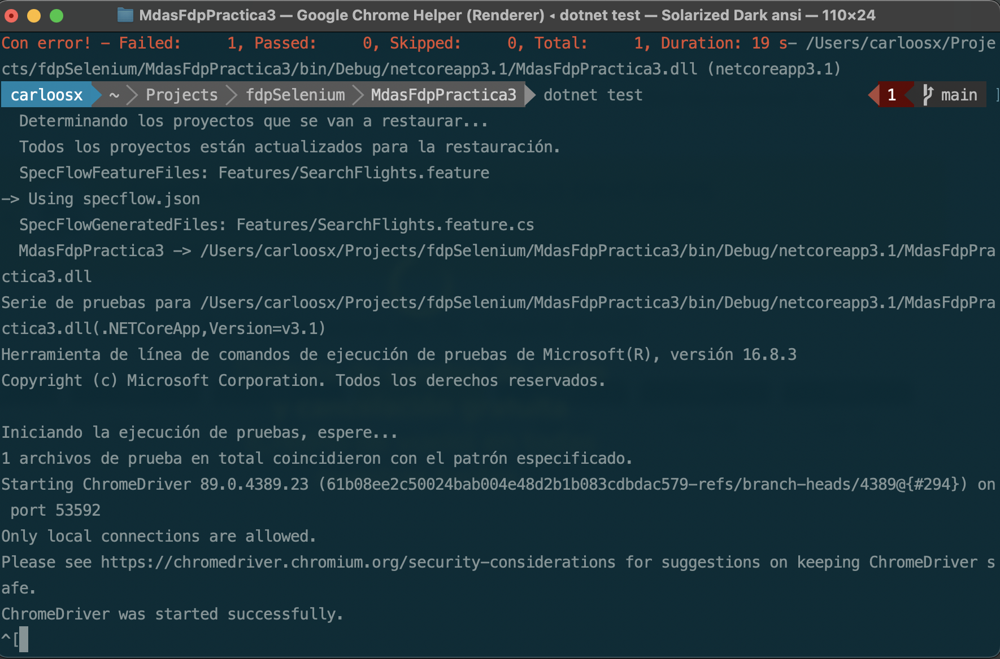
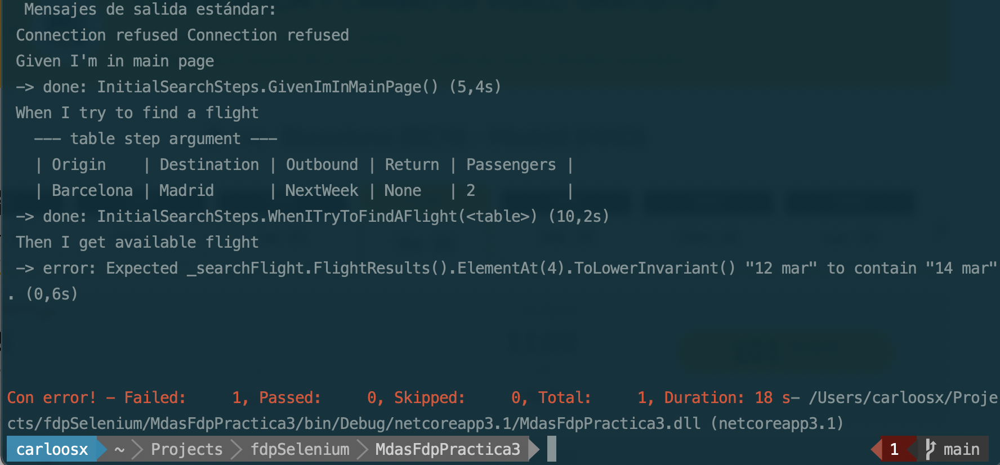
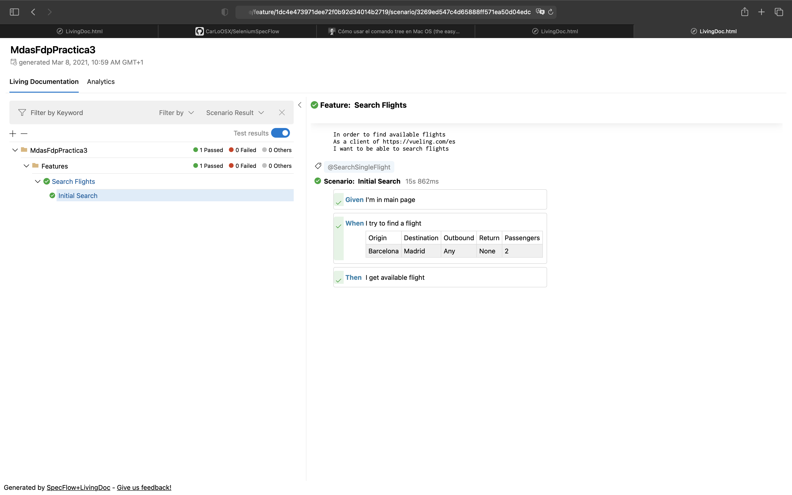
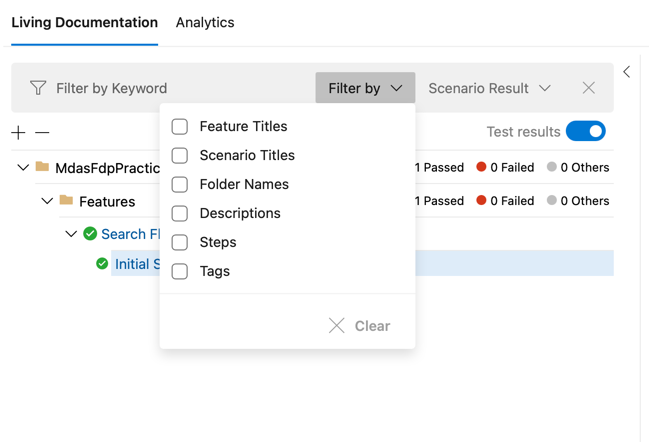
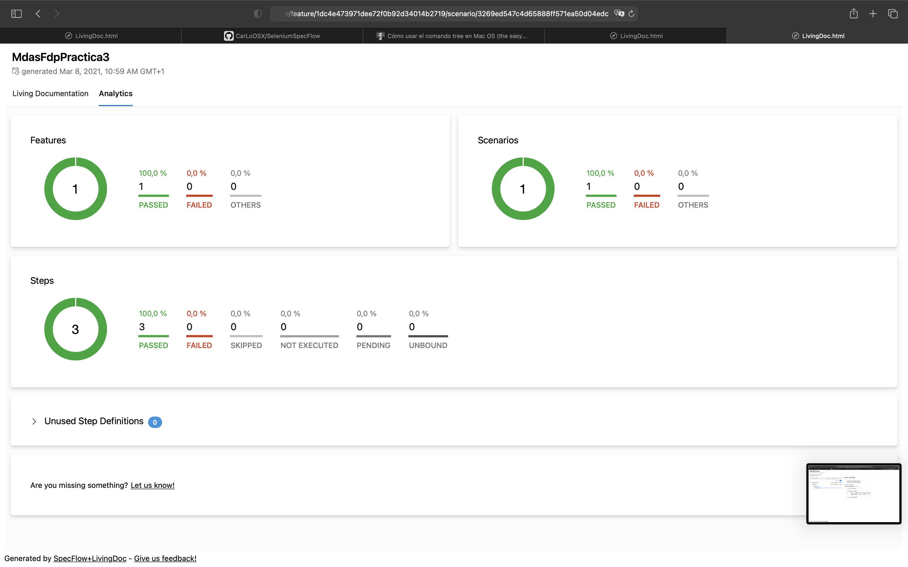
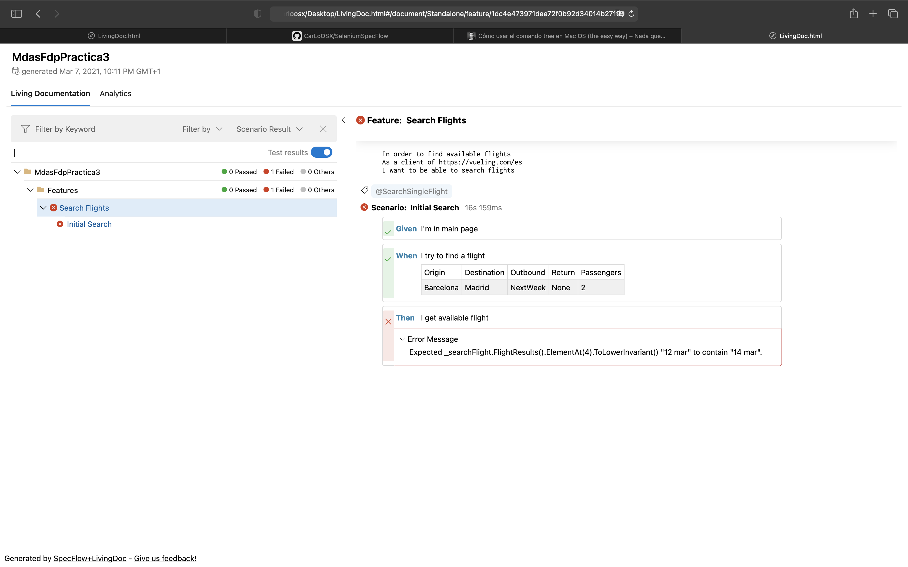
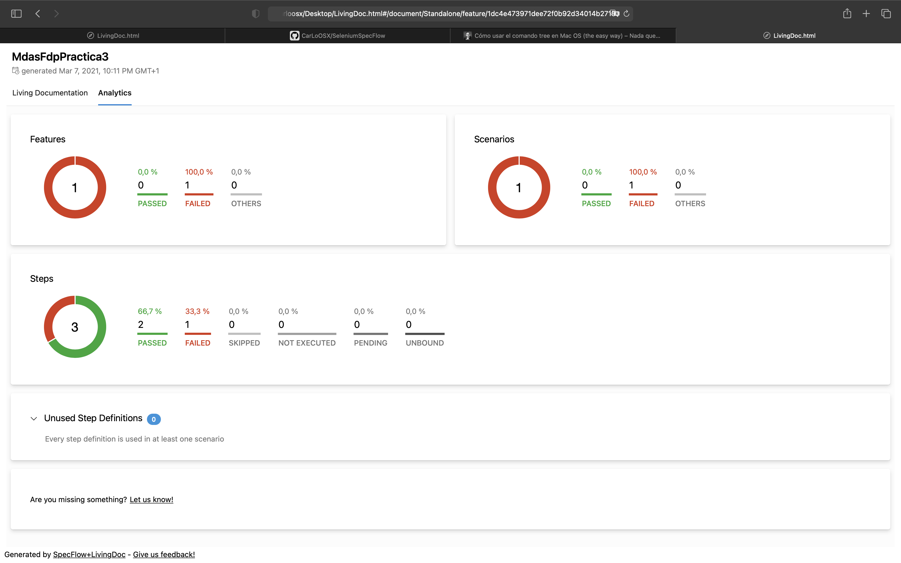

# .NET Core 3.1, Selenium with Gherkin & SpecFlow 


>Para hacer este proyecto he utilizado el lenguaje C# con el Framework de .NetCore y la librería SpecFlow + LivingDoc (Una librería de SpecFlow para la generación de reports)


## Información del Proyecto:
* Se ha aplicado el principio de responsabilidad única.
* Se ha desacoplado la parte de infraestructura (Selenium) de mediante la creación de un servicio "IWebDriverService" y la implementación en concreto de este mediante Selenium "SeleniumWebDriverService". Con esto se consige el desacoplamiento con Selenium de tal manera que podemos cambiar de Selenium a otra tecnología sin afectar a la lógica de funcionamiento.
* Se ha utilizado la Orientación a objetos para centrarlizar el comportamiento en estos.
* Se ha aplicado el patrón PageObject para, como en los puntos anteriores, mejorar el mantenimiento de las pruebas y reducir el código replicado.
* Al utilizar Orientación a objetos lo anteriormente mencionado, no he considerado necesario aplicar el patrón builder ya que no me aportaba ningún beneficio en este punto y lo consideraba OverEngineering.

## Ejecución de los Test

### Para poder ejecutar proyectos de .NetCore:
```
https://dotnet.microsoft.com/download
```
### Una vez instalado .NetCore, dirigirse hacia el directorio del Proyecto
```
cd {pathHaciaElDirectorioDelProyecto}/src/MdasFdpPractica3
```

### Y ejecutar:
```
dotnet test
```

### Se podrá ver algo similar a la siguiente imagen cuando se lanze el test:



#### Aquí debería lanzarse chrome, importante tener la última versión.

### A continuación, una vez acabe se vera el resultado de los test:



## Generación de Reports

### Para ver el documento Html del resultados de los test a modo de DashBoard, he utiliado la librería:

```
SpecFlow.Plus.LivingDocPlugin
```

Esta librería pertenece a SpecFlow y genera en el directorio de ejecución un fichero Json a partir del cual se generará el Report.

### Para instalar el CLI de la librería: 

```
https://docs.specflow.org/projects/specflow-livingdoc/en/latest/LivingDocGenerator/Installing-the-command-line-tool.html
```

#### Importante: livingdoc se encuentra instalado en la carpeta de nuget tools:
#### En el caso de mac en: 

```
$HOME/.dotnet/tools
```

### Para generar el report Ejecutar el siguiente comando reemplazando {pathHaciaElDirectorioDelProyecto} por la ruta hacia el proyecto:
Importante ejecutarlo desde la carpeta de nuget tools o exportarlo al path.

```
./livingdoc test-assembly {pathHaciaElDirectorioDelProyecto}/src/MdasFdpPractica3/bin/Debug/netcoreapp3.1/MdasFdpPractica3.dll -t {pathHaciaElDirectorioDelProyecto}/src/MdasFdpPractica3/bin/Debug/netcoreapp3.1/TestExecution.json
```

#### Ejemplo:

```
 carloosx  ~ | .dotnet | tools  ./livingdoc test-assembly ~/Projects/SeleniumSpecFlow/src/MdasFdpPractica3/bin/Debug/netcoreapp3.1/MdasFdpPractica3.dll -t ~/Projects/SeleniumSpecFlow/src/MdasFdpPractica3/bin/Debug/netcoreapp3.1/TestExecution.json 

/Users/carloosx/.dotnet/tools/LivingDoc.html was successfully generated.
```

### Una vez ejecutado se generará  el fichero "LivingDoc.html" en el directorio actual, en mi caso: 

```
/Users/carloosx/.dotnet/tools
```

```
carloosx  ~ | .dotnet | tools  tree  
.
├── LivingDoc.html
└── livingdoc

0 directories, 2 files
```

### Al abrirlo se mostrarán los resultados de la última ejecución, e incluso información como el lenguaje DSL de Gherkin:



### También se puede filtrar o buscar cualquier otro tipo de información:



### Y presentarlo de una manera mas general:



## Notas a tener en cuenta:

### He podido realizar correctamente los test siempre y cuando no modificase la fecha.
#### No ha sido posible modificar el valor de fecha, ya que, aun pintándose en la web de vueling la fecha deseada, al ser un input readonly no se aplicaba, de ahí que el test falle:

 




#### Por este motivo he creado un valor de enum de fechas "Any" que lo que hace es buscar para cualquier fecha:


